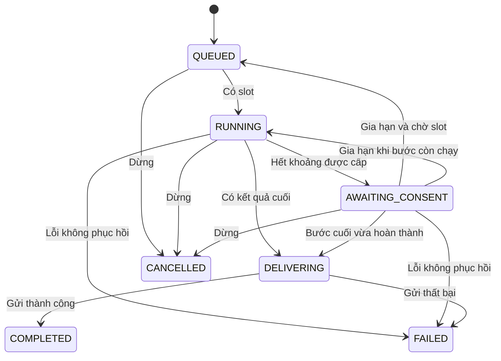

# Telegram Renewable AI Jobs — Implementation Plan

> **For agentic workers:** Use `superpowers:executing-plans` to implement this plan task-by-task. Steps use checkbox syntax for tracking. Only use subagents if separately authorized by the user or applicable instructions.

**Goal:** Bỏ hạn cứng của toàn câu hỏi trong chế độ mới; cập nhật tiến độ Telegram, xin gia hạn lặp lại và cho người đặt câu hỏi chủ động dừng mà không mất trạng thái giữa các lần gia hạn.

**Architecture:** Một JobManager sở hữu task xử lý độc lập với Telegram handler. JobControl điều khiển thời gian gia hạn, checkpoint hợp tác và hủy; router/orchestrator phát sự kiện thật và lưu kết quả từng tool. Telegram presenter cập nhật một tin trạng thái và callback handler xác thực nút theo job, người dùng và phiên gia hạn.

**Tech Stack:** Python 3.11/3.12, asyncio, aiogram, HTTPX, Pydantic Settings, unittest/IsolatedAsyncioTestCase. Không thêm Redis, Celery hoặc dịch vụ mới cho bản đầu.

**Spec:** Phần “Thiết kế đã thống nhất” trong chính tài liệu này là spec đi kèm kế hoạch. Người dùng đồng ý thiết kế trong cuộc trao đổi ngày 2026-09-14. Các mặc định vận hành dưới đây là quyết định triển khai đề xuất, phải được giữ rõ trong PR.

## Global Constraints

- Không có tổng deadline tự hủy trong chế độ gia hạn; gia hạn được lặp lại khi tác vụ còn khả năng tiếp tục.
- Hết khoảng thời gian chỉ xin gia hạn, không cancel coroutine xử lý.
- Chưa bấm tiếp tục: bước đã bắt đầu được hoàn thành trong timeout riêng; không mở thêm HTTP attempt/tool mới.
- Tiếp tục cùng request và trạng thái, không gọi lại orchestrator từ đầu.
- Gia hạn không reset số lỗi, retry token, số vòng/tool, provider health, evidence hoặc elapsed tổng.
- Giữ nguyên giới hạn retry/tool hiện có. Hết tool budget chuyển sang synthesis; hết provider khả dụng kết thúc bằng lỗi có thông tin, không hỏi gia hạn mãi.
- Chỉ người đặt câu hỏi được gia hạn. Người đặt câu hỏi và admin có thể dừng.
- Trạng thái dựa trên sự kiện thật; không mô tả suy nghĩ nội bộ hay suy đoán tiến độ model.
- Không ghi log prompt đầy đủ, API key, image base64 hoặc raw tool output.
- Giữ allowlist group, forum-topic isolation, rate limit người dùng, vision capability và Telegram HTML formatting.
- Bản đầu giữ checkpoint trong RAM; restart không phục hồi công việc. Không quảng cáo khả năng resume sau restart.
- Các đường HTTP vẫn giữ timeout cục bộ, SSRF guard, redirect validation, giới hạn response và cleanup cancellation.

## Thiết kế đã thống nhất

### Hành vi và thời gian

1. Handler kiểm tra quyền/rate limit và giới hạn job, tạo một tin trả lời trạng thái có nút Dừng; sau đó bàn giao cho JobManager.
2. Trước khi được slot chạy, tin nhắn ghi “Đang chờ lượt xử lý”. Không tiêu hao thời gian gia hạn trong hàng đợi.
3. Lần được chạy đầu tiên nhận 180 giây. Hết khoảng này, hiện Tiếp tục/Dừng và chuyển AWAITING_CONSENT. Các thao tác đã bắt đầu được hoàn thành; không dispatch thêm thao tác mới.
4. Mốc tiếp theo được cấp khi người dùng bấm Tiếp tục. Nếu còn bước đang chạy thì áp dụng ngay; nếu đang chờ tài nguyên thì bắt đầu tính khi được chạy lại. Double-click không cấp hai lần.
5. Thời gian tổng hiển thị tính từ lúc nhận câu hỏi, không reset; ghi riêng thời gian xử lý và thời gian chờ khi cần. Đồng hồ monotonic dùng để điều phối; không dùng thời gian hệ thống cho deadline.
6. “Bước” là một lần provider.chat(), một lần gọi backend search/reader, hoặc media load; retry/fallback tiếp theo là bước mới. Checkpoint trước từng bước và sau khi lấy slot, không chỉ trước cả batch.
7. Nếu HTTP đang chạy trả về câu trả lời cuối sau khi xin gia hạn, gửi kết quả luôn; không bắt người dùng gia hạn để nhận kết quả đã có. Nếu chỉ trả tool calls thì lưu rồi chờ consent trước khi chạy tool.
8. Không có lựa chọn thì chờ vô thời hạn trong RAM, không tiếp tục tiêu thụ AI/crawl. Giới hạn số job được tiếp nhận ngăn tích lũy vô hạn; không tự xóa job đang chờ để nhận job mới.
9. Cập nhật tối đa một lần mỗi 25 giây cho trạng thái thông thường; chuyển trạng thái consent/terminal được ưu tiên. Khi đã đứng chờ consent ổn định thì ngừng cập nhật đồng hồ liên tục; ghi thời gian tại mốc và thời điểm bắt đầu chờ.
10. Dừng hủy ngay các coroutine do job sở hữu, await cleanup, gỡ nút và xác nhận. Hủy phía client không được mô tả là bảo đảm provider/Crawl4AI server đã ngừng tính toán.

### State machine



State transition dùng lock ngắn theo job, không await mạng trong lock. Trước DELIVERING, terminal/dừng thắng thì không gửi answer. Khi đã DELIVERING, gỡ nút Dừng và callback cũ báo kết quả đang được gửi. Không cam kết exactly-once qua Telegram nếu mất phản hồi mạng sau send; giữ payload và message IDs đã xác nhận trong RAM, không tự chạy lại AI.

### Phạm vi phát hành

**Release 1 (kế hoạch này):** Gia hạn, pause tại checkpoint trong RAM, stop, progress, isolation context, timeout từng bước, bounded concurrency và rollout flag.

**Release 2 (kế hoạch riêng sau):** Checkpoint bền vững và phục hồi sau restart; reader CSV/FRED và lựa chọn backend theo content type. Không phụ thuộc Release 2 để nghiệm thu Release 1. SQLite trong Docker volume là ứng viên cho một bot process; chỉ chọn sau khi có schema checkpoint portable và chính sách lưu media.

## Bằng chứng repo và điểm tích hợp

Đã đọc source `main` qua GitHub; chưa xác nhận commit đang deploy. Executor phải ghi `git rev-parse HEAD` lúc bắt đầu và đọc AGENTS.md tại checkout cùng các thư mục đích. Root AGENTS.md không có tại thời điểm kiểm tra; không suy ra thư mục con cũng không có.

| File đã xác minh | Hành vi hiện tại | Thay đổi cần thiết |
|---|---|---|
| `app/main.py` | Polling chỉ nhận message/my_chat_member; shutdown chỉ gom dispatcher tasks | Thêm callback_query; quản lý shutdown job trước khi đóng clients |
| `app/bot/handlers.py` | Deadline bao cả chờ lock, ask và gửi answer | Tách submission/job runner; giữ legacy path dưới flag |
| `app/core/context.py` | Memory theo chat/topic; push từng message | Snapshot cố định theo job; commit user/assistant thành cặp |
| `app/core/orchestrator.py` | URL cache/inflight task nằm trong ask | Truyền JobControl; cleanup inflight task; cache xuyên gia hạn |
| `app/ai/router.py` | Ghi outputs sau gather cả batch; retry state request-local | Lưu từng output theo index; gate mỗi attempt/tool; không reset state |
| `app/ai/synthesis.py` | Fresh synthesis không dùng tool | Tiếp tục tận dụng khi tool budget hết; không ép synthesis do xin gia hạn |
| `app/search/url_service.py` | Crawl4AI rồi generic fallback | Gate giữa các backend; hạn tổng URL loại trừ thời gian pause |
| `app/search/reader.py` | Jina rồi direct trong timeout generic | Gate trước direct; tránh pause bị tính thành reader timeout |
| `app/search/crawl4ai_client.py` | HTTPX timeout, chưa có wall timeout riêng | Bọc toàn attempt trong asyncio.timeout cục bộ |
| `app/config.py`, `.env.example`, `scripts/sync_env.py` | QUESTION_TIMEOUT_SEC hard deadline; sync giữ giá trị | Thêm canonical settings mới; không âm thầm đổi nghĩa key cũ |
| `tests/run_tests.py` | Chạy unittest discovery | Test mới dùng unittest, không thêm pytest |

## Cấu hình đề xuất và compatibility

```dotenv
QUESTION_CONTROLS_ENABLED=0
QUESTION_RENEWAL_INTERVAL_SEC=180
QUESTION_PROGRESS_INTERVAL_SEC=25
QUESTION_MAX_INFLIGHT_OPERATIONS=2
QUESTION_MAX_PENDING_JOBS=20
QUESTION_MAX_JOBS_PER_USER=2
AI_ATTEMPT_TOTAL_TIMEOUT_SEC=90
URL_READ_TOTAL_TIMEOUT_SEC=40
TOOL_CALL_TOTAL_TIMEOUT_SEC=45
```

Các key mới là đề xuất, chưa tồn tại trong repo. Flag mặc định 0 trong giai đoạn triển khai để deploy code trước rồi bật riêng; rollout mục tiêu chuyển sang 1 sau smoke. Khi flag=1, QUESTION_TIMEOUT_SEC không áp dụng cho toàn câu hỏi. Giữ key này chỉ cho legacy rollback và startup log nói rõ chế độ đang dùng. Sửa validation crawl timeout < question timeout để chỉ áp dụng legacy; không làm flag=1 phụ thuộc hạn cứng đã bỏ.

Tất cả số giây >0, hữu hạn; operation cap 1..16, pending cap 1..200, per-user cap 1..10 và <= pending cap. Interval progress < interval renewal. Crawl attempt dùng min(CRAWL4AI_TIMEOUT_SEC, thời gian URL còn lại); từng generic backend dùng phần còn lại của URL budget. TOOL_CALL_TOTAL_TIMEOUT_SEC >= URL_READ_TOTAL_TIMEOUT_SEC; tổng operation budget không bao gồm thời gian chờ consent hoặc semaphore.

AI_ATTEMPT_TOTAL_TIMEOUT_SEC là hạn tổng mỗi provider.chat, giữ nguyên provider-specific read timeout. Expiry của guard này được chuyển thành ProviderError retryable ReadTimeout theo cùng cơ chế classification hiện có; user stop vẫn là CancelledError, không ghi lỗi health.

## Hợp đồng module mới

Tất cả file mới bên dưới là đường dẫn dự kiến, không khẳng định đã tồn tại. Thời gian giả truyền bằng Callable[[], float] trong test; production dùng loop.time.

```python
# app/core/job_control.py
class JobStopped(Exception):
    pass

class JobControl:
    def __init__(self, *, renewal_sec: float, clock: Callable[[], float]): ...
    # Properties: state: str, generation: int, active_operations: int
    # state values: QUEUED/RUNNING/AWAITING_CONSENT/DELIVERING/COMPLETED/CANCELLED/FAILED
    async def activate(self) -> bool: ...  # first grant/resume after acquiring slot
    async def expire_if_due(self) -> bool: ...  # exactly one generation change
    async def checkpoint(self) -> None: ...  # wait consent; raise JobStopped on stop
    async def renew(self, generation: int) -> bool: ...
    async def stop(self) -> bool: ...
    async def begin_delivery(self) -> bool: ...
    async def finish(self, state: str) -> None: ...

# app/core/job_progress.py
@dataclass(frozen=True)
class ProgressEvent:
    kind: str  # stage_started/stage_finished/provider_fallback/tool_finished
    label: str  # sanitized display text
    ok: bool | None = None

# app/core/job_operations.py
class OperationRunner:
    def __init__(self, control: JobControl, slots: asyncio.Semaphore,
                 emit: Callable[[ProgressEvent], None]): ...
    async def run(self, label: str, factory: Callable[[], Awaitable[T]],
                  *, timeout_sec: float) -> T: ...

# app/core/job_manager.py
@dataclass(frozen=True)
class JobSubmission:
    question: str
    quoted: str | None
    owner_id: int
    chat_id: int
    topic_id: int | None
    request_message_id: int
    status_message_id: int
    history: list[dict]
    prepare_request: Callable[[OperationRunner], Awaitable[UserRequest]]

class JobManager:
    # Own all job task references; UUID-derived job_id, owner/chat/topic,
    # request_message_id, status_message_id, request, history snapshot,
    # JobControl, task, timestamps, answer, delivery outcome, event reducer.
    async def submit(self, submission: JobSubmission) -> str: ...
    async def renew(self, job_id: str, generation: int, actor_id: int,
                    chat_id: int, status_message_id: int) -> str: ...
    async def stop(self, job_id: str, actor_id: int,
                   chat_id: int, status_message_id: int) -> str: ...
    async def shutdown(self) -> None: ...
```

Module core/job_manager chỉ điều phối; Telegram I/O nằm trong injected runner/presenter của bot layer để tránh import vòng. JobSubmission chứa metadata và factory prepare_request từ bot layer; manager đăng ký job trước khi gọi factory tải media dưới local timeout. Khi factory hoàn thành, lưu UserRequest và bỏ reference factory để không giữ Message qua toàn đời job. Admission task cũng do manager sở hữu nên stop được media loading. Core không import aiogram Message; annotation trong các code block là contract dự kiến, không phải patch đầy đủ.

## Task 1 — JobControl và khoảng gia hạn

**Files:** Create `app/core/job_control.py`, `tests/test_job_control.py`; modify `app/config.py`, `.env.example`, `tests/test_config_regressions.py`.

**Interfaces:** Produces JobControl theo hợp đồng trên, config keys mới. Chưa thay đường chạy production.

- [ ] Viết test thất bại bằng IsolatedAsyncioTestCase, clock giả, không chờ 180 giây thật:

```python
async def test_renewal_preserves_task_and_rejects_duplicate(self):
    now = [0.0]
    c = JobControl(renewal_sec=180, clock=lambda: now[0])
    await c.activate()
    now[0] = 181.0
    self.assertTrue(await c.expire_if_due())
    self.assertEqual(c.state, "AWAITING_CONSENT")
    generation = c.generation
    waiting = asyncio.create_task(c.checkpoint())
    await asyncio.sleep(0)
    self.assertFalse(waiting.done())
    self.assertTrue(await c.renew(generation))
    self.assertFalse(await c.renew(generation))
    await c.activate()
    await waiting
```

- [ ] Run `python -m unittest tests.test_job_control -v`; xác nhận fail vì module/behavior chưa có.
- [ ] Implement lock ngắn, Event cho consent/stop, generation chống double-click. Renew làm QUEUED hoặc RUNNING tùy active_operations; checkpoint được đánh thức để thử lấy slot, activate mới bật clock khi không còn operation chạy.

```python
# Atomic intent inside renew; no network awaits in this critical section.
if state != "AWAITING_CONSENT" or generation != current_generation:
    return False
# Grant once, invalidate old continue button, wake parked work.
```

- [ ] Thêm test expire/renew 10 lần cùng control; stop đánh thức waiter; expire chỉ phát một lần; không cấp interval khi chưa có slot; delivery thắng expiry; stop thắng begin_delivery; validation NaN/inf/zero.
- [ ] Run `python -m unittest tests.test_job_control tests.test_config_regressions -v`; expected PASS. Commit `feat: add renewable question control state`.

## Task 2 — OperationRunner và pause an toàn giữa các network attempt

**Files:** Create `app/core/job_operations.py`, `app/core/job_progress.py`, `tests/test_job_operations.py`; modify `app/search/url_service.py`, `app/search/reader.py`, `app/search/crawl4ai_client.py`.

**Interfaces:** OperationRunner.run nhận factory thay vì coroutine đã tạo; optional runner được truyền vào URL services, mặc định None giữ caller compatibility. Không giữ global slot qua checkpoint chờ consent.

- [ ] Viết test với thao tác đầu blocked trên Event; expire control, giải phóng thao tác đầu và xác nhận fallback chưa bắt đầu trước renew:

```python
async def test_existing_operation_finishes_after_expiry(self):
    now = [0.0]
    control = JobControl(renewal_sec=180, clock=lambda: now[0])
    runner = OperationRunner(control, asyncio.Semaphore(1), lambda event: None)
    entered, release = asyncio.Event(), asyncio.Event()
    async def slow():
        entered.set()
        await release.wait()
        return "evidence"
    task = asyncio.create_task(runner.run("URL", slow, timeout_sec=1))
    await entered.wait()
    now[0] = 181.0
    await control.expire_if_due()
    release.set()
    self.assertEqual(await task, "evidence")
    self.assertEqual(control.state, "AWAITING_CONSENT")
```

- [ ] Run `python -m unittest tests.test_job_operations -v`, expected FAIL trước implementation.
- [ ] Implement acquisition loop: checkpoint → acquire semaphore → recheck permission atomically → activate/mark operation → execute → release. Nếu consent hết trong khi xếp hàng, trả slot trước khi đợi. Timeout chỉ bao factory, không bao gate/queue.

```python
# Inside an authorized acquired operation, not around checkpoint():
async with asyncio.timeout(timeout_sec):
    result = await factory()
# finally: decrement active count, release slot, emit completion/failure.
```

- [ ] Track URL budget bằng tổng duration các attempt đã chạy, không dùng một deadline bao cả pause. Gate giữa X resolver/Crawl4AI/Jina/direct. Existing nested timeouts phải được di chuyển để thời gian chờ consent không bị coi là tool error. Không acquire slot lồng nhau: composite tool/reader điều phối, chỉ leaf network attempt giữ slot. X/search có pipeline riêng: truyền gate đến từng backend attempt hoặc chứng minh toàn bộ wrapper là bounded single step và ghi rõ trước release.
- [ ] Tool budget cũng cộng thời gian thực thi leaf attempts, không bọc composite coroutine đang chờ consent bằng asyncio.timeout. Với reader/backend dùng task hoặc executor thread, cancellation phải thu dọn task Python được sở hữu; thread đang chạy không thể bị kill bằng cancel, nên giữ timeout backend và theo dõi giới hạn phần việc đang chạy đến lúc thực sự kết thúc. Không giải phóng capacity rồi cho phép tạo vô hạn thread còn sống.
- [ ] Thêm tests: đọc response trickle vẫn chạm wall timeout; stop propagate CancelledError; tất cả fallback cộng lại không vượt URL budget; không gọi direct sau pause; hai job tổng số leaf operation không vượt global cap; queued task không giữ slot.
- [ ] Run test module + reader/crawl regressions qua discovery; commit `feat: bound operations and pause backend transitions`.

## Task 3 — Router giữ kết quả từng tool và tiếp tục đúng trạng thái

**Files:** Modify `app/ai/router.py`, `app/core/orchestrator.py`; create `tests/test_job_router.py`.

**Interfaces:** Thêm keyword `operations: OperationRunner | None = None` vào `Orchestrator.ask` và `AIProviderRouter.complete`; thread xuống mỗi attempt. Progress reducer nhận event, không nhận raw output. URL/service callbacks dùng cùng job control.

- [ ] Viết test fake provider + fake tool executor: hai tool, một hoàn thành ngay, một chờ Event. Expire rồi xác nhận evidence đầu đã được lưu, tool thứ ba chưa dispatch; renew không gọi lại tool đầu.
- [ ] Run `python -m unittest tests.test_job_router -v`, expected FAIL.
- [ ] Thay batch-only append bằng per-index slot ngay lúc complete; vẫn dựng canonical tool messages theo thứ tự tool_calls khi batch đủ kết quả. Không replay completed slot khi resume/fallback.

```python
# Per-tool completion, once, inside request-local batch state:
outputs[index] = str(output)[:6000]
completed[index] = True
# Retain successful evidence now; append protocol messages once, in original order.
```

- [ ] Gate trước provider.chat và mọi same-provider retry/rotation attempt; bọc AI attempt bằng local wall timeout. Theo source hiện tại dùng ProviderError + TransportFailureKind.READ_TIMEOUT, giữ nguyên policy retry. Không biến stop thành provider failure. Không đóng tool budget chỉ vì hết renewal interval.
- [ ] Trong orchestrator finally, cancel/gather toàn bộ url_inflight còn lại. Không để URL task sống ngoài job. Cache và router state được giữ vì cùng coroutine đang pause.
- [ ] Thêm test: final response đến sau expiry được trả; tool-call response đến sau expiry được giữ nhưng không execute; 10 lần renew không reset retry/calls/rounds; tool exception không làm mất output khác; cancellation không tăng provider health failure; synthesis fallback giữ evidence; URL cache không refetch sau renew.
- [ ] Run `python -m unittest tests.test_job_router tests.test_provider_transport_retry tests.test_provider_portability tests.test_provider_retry_health -v`; expected PASS. Commit `feat: retain research state across question renewals`.

## Task 4 — JobManager, admission và context isolation

**Files:** Create `app/core/job_manager.py`, `app/bot/question_runner.py`, `tests/test_job_manager.py`; modify `app/core/context.py`, `app/bot/handlers.py`.

**Interfaces:** Final core submission DTO `JobSubmission` chứa fields đã mô tả; core manager `submit(submission: JobSubmission) -> str`. Bot runner nhận injected bot/media_loader/orchestrator/memory/stats và chuyển Message thành DTO; manager cũng sở hữu admission task để stop được media load. Manager owns references, global operation semaphore và registry; không có một semaphore toàn job giữ suốt thời gian pause.

- [ ] Viết test concurrent jobs cùng chat: A chờ consent, B hoàn tất; B không đợi A; cả hai dùng snapshot bất biến và chỉ commit cặp history sau answer được gửi thành công.
- [ ] Run `python -m unittest tests.test_job_manager -v`, expected FAIL.
- [ ] Implement active/pending limits atomically trước task creation. Jobs admission/running/paused đều tính vào cap; owner cap không reset khi renew. Registry lookup `(chat_id, request_message_id)` ngăn duplicate submission trong cùng process.
- [ ] Bỏ khóa chat bao toàn ask ở path mới. `ChatMemory.push_exchange(conversation_key, user_text, assistant_text)` synchronous, không await giữa hai push. Chụp history lúc job được chấp nhận; commit theo thứ tự hoàn tất, không trộn user/assistant khác job. Mỗi answer reply đúng request message/topic. Không tự nhập kết quả mới của job khác vào snapshot đang chạy.

```python
history = memory.history_for(conversation_key, settings.max_context_turns)
# store copied history in job; do not rebuild after renewal
if delivered:
    memory.push_exchange(conversation_key, memory_text, plain_answer)
```

- [ ] Extract delivery logic hiện có vào bot runner, giữ HTML splitting, sources/images, provider stats, vision errors. Snapshot/result memory chứa text đã sanitize theo giới hạn hiện tại; không ghi base64 vào chat history.
- [ ] Task registry không drop strong reference sớm; done callback thu exception và cleanup; terminal lookup cache bounded 256 records chỉ giữ ID/owner/outcome, xóa payload/media khi không còn cần. Callback job không tồn tại trả expired an toàn.
- [ ] Một monitor do manager sở hữu kiểm tra các job đang RUNNING mỗi 1 giây qua expire_if_due; update trạng thái không phụ thuộc provider phát token. Monitor chỉ enqueue snapshot, không await Telegram tuần tự gây chặn job khác. Đồng hồ interval dừng khi không có active operation và job đang chờ capacity/consent; activate tiếp tục phần được cấp còn lại, chỉ renew mới cấp interval mới. Tổng elapsed luôn tăng. Giảm registry payload theo terminal cleanup, dừng monitor khi shutdown.
- [ ] Tests: queue full/per-user full trả thông báo ngay; duplicate message không gọi AI hai lần; topic tách biệt; stop media loading; không tăng questions_total/fallback metrics khi renew; paused job không làm toàn bot hết slot.
- [ ] Run `python -m unittest tests.test_job_manager -v`; expected PASS. Commit `feat: run questions as independently controlled jobs`.

## Task 5 — Telegram progress và callback quyền hạn

**Files:** Create `app/bot/job_status.py`, `app/bot/job_callbacks.py`, `tests/test_job_telegram.py`; modify `app/bot/handlers.py`.

**Interfaces:** `build_job_callback_router(settings, manager) -> Router`; presenter render từ job snapshot; per-job serialized editor ngăn edit cũ ghi đè terminal. Callback data `qj:<short_job_id>:<generation>:c` hoặc `qj:<short_job_id>:<generation>:s`, validate <=64 bytes.

- [ ] Viết test CallbackQuery mock: stranger không renew/stop; owner renew đúng generation một lần; admin chỉ stop; forged chat/status message bị từ chối; callback query không có accessible message an toàn.
- [ ] Run `python -m unittest tests.test_job_telegram -v`, expected FAIL.
- [ ] Callback ack ngay, rồi kiểm tra/transition nhanh. Renew bắt buộc generation đúng; stop từ nút cũ của cùng job vẫn được chấp nhận nếu owner/admin và job chưa DELIVERING/terminal, để nút Dừng không mất tác dụng do status vừa đổi.

```python
await query.answer()  # bounded Telegram call, before slow status editing
# Validate namespace, job id, actor, chat, message, generation for continue.
# Manager mutation returns a small result code; presenter updates after mutation.
```

- [ ] Render text tiếng Việt, escape dynamic HTML. Mẫu RUNNING: “Đã chạy: 2 phút 10 giây. Đang chờ B.AI phản hồi — 32 giây. Đã đọc được 3 nguồn.” Mẫu AWAITING_CONSENT: “Quá trình lâu hơn dự kiến. Đã chạy: 3 phút 12 giây. Bạn muốn tiếp tục thêm 3 phút không?” Thêm “Đang hoàn tất bước hiện tại” nếu còn active operation; ngược lại “Đang chờ lựa chọn của bạn”. Không hiển thị phần trăm không có căn cứ.
- [ ] Coalesce progress events trong RAM, flush tối đa mỗi 25s; không edit message identical; RetryAfter theo delay upstream, không spam retry. Telegram API failures không ghi thành lỗi AI. Message bị xóa: tạo tối đa một replacement được quản lý và cập nhật ID; nếu không thể liên lạc, để job park tại consent boundary, không tự cấp gia hạn.
- [ ] Test done/stop/renew race, stale buttons, callback double delivery, Unicode callback size, progress 429, deleted status, final update không bị heartbeat ghi đè. Dừng xác nhận sau local cleanup; user stop không gửi generic timeout/error.
- [ ] Run `python -m unittest tests.test_job_telegram -v`; expected PASS. Commit `feat: add Telegram progress and renewal controls`.

## Task 6 — Startup, polling và shutdown

**Files:** Modify `app/main.py`, `app/bot/handlers.py`; create `tests/test_job_lifecycle.py`.

**Interfaces:** Main tạo shared manager/presenter, inject dependencies, include callback router; feature flag chọn legacy hoặc controlled path. Main owns manager shutdown trước network clients.

- [ ] Viết test start_polling args chứa callback_query; test shutdown job blocked on consent/provider và assert không còn owned tasks khi providers.aclose được gọi.
- [ ] Run `python -m unittest tests.test_job_lifecycle -v`, expected FAIL.
- [ ] Wire startup:

```python
allowed_updates = ["message", "my_chat_member", "callback_query"]
# include job callback router in addition to existing message/lifecycle routers
# finally: stop admissions -> manager.shutdown() -> presenter close -> bot close
# -> Crawl4AI/search clients close -> providers close
```

- [ ] Shutdown không tiếp tục công việc mới; cancel/gather job/admission/monitor tasks trong local bounded grace dưới Docker stop_grace_period 30s. Cố gắng cập nhật interrupted trước đóng Telegram session, nhưng không chặn shutdown vì Telegram lỗi. Restart registry mới; nút cũ báo “Tác vụ không còn hoạt động do bot đã khởi động lại”. Không tự submit lại từ callback cũ.
- [ ] Verify legacy flag=0 vẫn trả timeout cũ, flag=1 không có outer hard deadline dù qua nhiều interval; /help cập nhật controls; startup log ghi feature mode/interval/caps.
- [ ] Run `python -m unittest tests.test_job_lifecycle -v`; expected PASS. Commit `feat: integrate controlled jobs with bot lifecycle`.

## Task 7 — End-to-end regressions, tài liệu và rollout

**Files:** Create `tests/test_question_renewal_flow.py`, `docs/QUESTION_CONTROLS.md`; modify `README.md`, `docs/README.md`, `docs/ENV_SYNC.md`, `scripts/sync_env.py` chỉ nếu cần migration (không đổi legacy key semantics).

**Interfaces:** Offline scenario fakes for Telegram/provider/URL use real manager/control/router integration. Không gọi API production trong test.

- [ ] Viết kịch bản offline: Chainnode ReadTimeout → B.AI tool calls → URL1 thành công, URL2 chậm/403 → hết interval → bấm tiếp tục hai lần theo hai generation → answer. Assert URL1 gọi một lần, provider retry budget không reset, một final answer và đúng topic.
- [ ] Thêm kịch bản stop trong network/consent/queue; all providers failed; final response trùng lúc expire; paused A không chặn B; shutdown làm buttons stale; reply ảnh vẫn đúng; không gửi sources sau stop thắng trước delivery.

```python
# Mandatory behavioral assertions in integration tests:
self.assertEqual(fetch_counts[url1], 1)
self.assertEqual(final_answer_count, 1)
self.assertEqual(renewals_accepted, 2)
self.assertEqual(outstanding_owned_tasks, 0)
```

- [ ] Run `python -m unittest tests.test_question_renewal_flow -v` trước khi fix tích hợp; xác nhận lỗi cụ thể nếu wiring chưa đúng. Chỉ sửa những đường đã nằm trong scope.
- [ ] Document time semantics, memory snapshot ordering, user/admin rights, limits, restart limitation, flag rollback, local timeout vs renewal. Sửa các câu README nói QUESTION_TIMEOUT_SEC luôn bao mọi câu hỏi.
- [ ] Verify full suite một lần trên Python 3.11 và 3.12 theo CI; run:

```bash
python tests/run_tests.py
python -m ruff check .
python -m pip check
python -m compileall -q app tests scripts
```

- [ ] Trong checkout thử nghiệm riêng dùng env fixtures không có secret để chạy sync_env hai lần và assert idempotence; không copy .env.example đè .env thật. Compose config validation và Docker build theo CI hiện có.
- [ ] Commit `test: cover renewable question lifecycle and rollout docs`; mở draft PR khi implementation đã được giao, mô tả acceptance evidence và giới hạn RAM. Không auto-merge/deploy.

## Rollout và rollback

1. Deploy code với QUESTION_CONTROLS_ENABLED=0, giữ cấu hình timeout provider đang chạy. Bản kế hoạch không thực hiện deploy.
2. Smoke trên bot/group thử nghiệm do operator chỉ định: text, search, URL, ảnh, topic, 2 renewals, stop, restart. Không gửi vào group thật nếu chưa được giao smoke tại đó.
3. Bật flag=1 trên deployment mục tiêu sau khi test đạt; khởi tạo lại container để nạp env. Request đang chạy lúc deploy được thông báo interrupted nếu có thể; không hứa tự phục hồi.
4. Quan sát event logs: job_created, operation_started/finished, renewal_requested/accepted, paused, cancelled, completed, failed; request/job ID, stage duration, active duration, total elapsed, outcome. Log số lần renewal nhưng không log callback secrets/prompt/raw source.
5. Theo dõi tỉ lệ completed/failed/user_cancelled, nguồn timeout, số paused, callback rejects, pending/active, thời gian không có event tiến độ. “Không có tiến độ” là thông báo chẩn đoán, không tự hủy cả job.
6. Rollback flag=0 cho request mới bằng config/recreate; tài liệu nói rõ controlled job trong RAM sẽ mất khi restart. Nếu rollback bằng code revision, dùng known-good deployment đã ghi nhận trước rollout.

## Checklist nghiệm thu cuối

- [ ] Hết 180 giây không hủy request; nút gia hạn xuất hiện một lần mỗi generation.
- [ ] Gia hạn >=10 lần trong test giữ cùng job, evidence, retry/tool counters; không có global cap theo elapsed.
- [ ] Chưa đồng ý thì không phát sinh network step mới, kể cả fallback trong reader và retry trong provider.
- [ ] Mỗi network step có local bound; pause/queue không bị tính thành timeout mạng.
- [ ] Stop hoạt động khi queued/running/paused, không nuốt cancellation, không còn task con local.
- [ ] Final answer đến sau mốc vẫn được giao; callback cũ không làm job sống lại.
- [ ] Một job chờ consent không khóa group hay chiếm slot operation.
- [ ] Snapshot/history theo job và topic; delivery giữ HTML, sources và vision hiện có.
- [ ] Rate limit/job caps chặn admission quá tải; tiếp tục không tạo request mới.
- [ ] Polling nhận callback_query; actor/chat/message/generation validation đầy đủ.
- [ ] Shutdown đóng owned tasks trước clients; restart limitation ghi rõ cho người dùng.
- [ ] CI 3.11/3.12, lint, env sync, Compose/build theo gate hiện có đều đạt.

## Handoff

Thứ tự phụ thuộc: Task 1 → Task 2 → Task 3 → Task 4 → Task 5 → Task 6 → Task 7. Có thể gom thành ba PR theo mốc review: core control/operations/router; manager/Telegram/lifecycle; integration tests/docs/rollout. Giữ feature flag tắt tới khi cả ba được tích hợp và nghiệm thu.

Kế hoạch này là deliverable nghiên cứu/thiết kế; chưa chỉnh code chạy bot, chưa chạy test implementation, chưa tạo PR hay deploy. Khi bắt đầu code, executor phải đối chiếu revision repo mới nhất và cập nhật đường test nếu source đã thay đổi.
